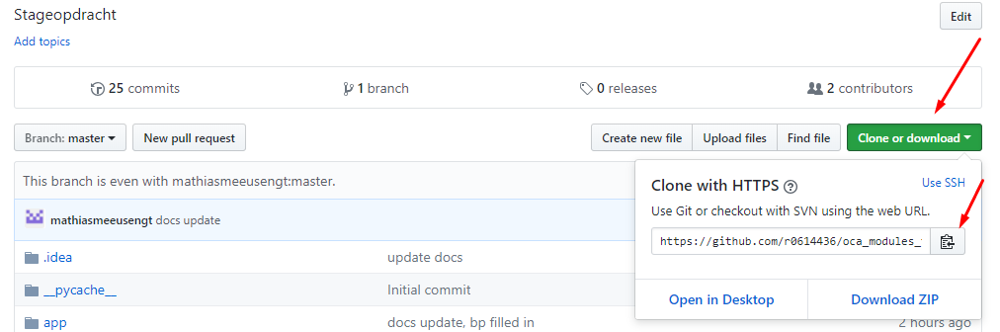
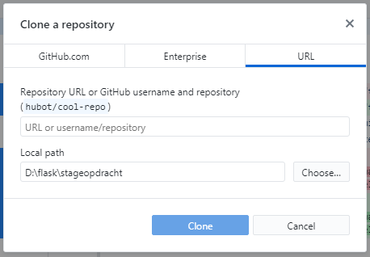
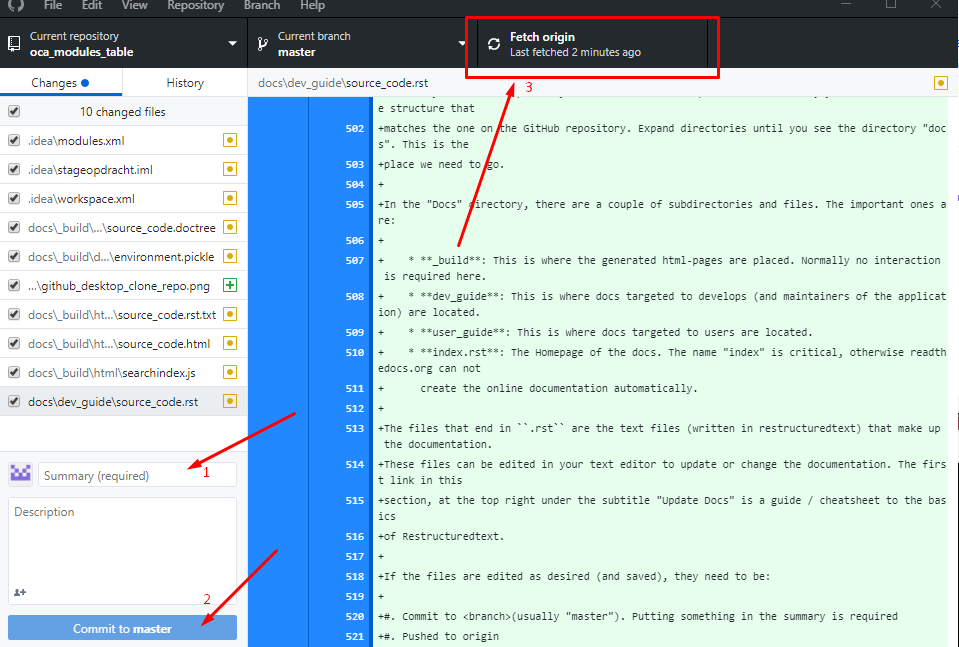

Source Code
###########

*This page is intended for developers. Here is explained what all the functions are and where code needs to be changed
in certain events (eg.: adding a new odoo version).*

Database model
==============

The image below shows how the database looks like, it has two objects, Repository and Module.
One repository can have multiple modules, but one module cannot have multiple repositories

.. image :: diagram.png

Python files
============

This section explains what each function in each .py file does. The names of the titles are not identical to the files,
but strongly resemble them.

Routes
------

This file contains all the 'routes' of the application. Routes are functions that specify what logic must be executed
when the client requests a URL. The routes in this application are usually built in the same way:

#. ``@app.route('/name_page/<variable>, methods=['GET', 'POST'])``
#. ``def name_page(variable):``
#. ``# body``
#. ``return render_template('name_page.html', 'title', var1=var1, var2=var2, ...)``

1. Specify the URL of the page along with optional variables and which methods this page is allowed to use
2. Actual definition of the function, with or without variable(s)
3. The code that runs when this page is accessed
4. A return statement that either returns a template or redirects to another route

First is a URL that will also be shown in the url-bar of your browser. If a variable needs to be passed along to this
page, it's possible to add this to the URL ``/name_page_to_visit/<variable>``. The greater than and lesser than
need to stay, this way the program knows it's a variable and not a solid part of the url.
If there is no variable in the URL, the actual function is created with empty parentheses. When one or more variables
are placed in the URL, they need to be placed in the parentheses. These variables can then be used in the body.
At the end of the body is a return statement with
a ``render_template('name_page.html', 'title', var1=var1, var2=var,...)``. This renders a html page with jinja2.
The variables passed along after the title can be used in the template.

The body can also contain an if-statement with a ``validate_on_submit()``. This is a function from flask-wtforms.
This if-statement is true when a button from a form on the page is pressed and no errors are raised.
There's either some code to be run or a function call behind this if-statement. If the program has run through the
entire body, it comes upon a separate return-statement on the same level as the if-statement. This return either has a
return_template or a ``return redirect(url_for('name_page', var1=var1,...))``. This redirects the browser to the page
that matches the name inside the parentheses.

Functions
---------
This section will give a bit of explanation for the functions in 'functions.py'.

.. note::

    The Repository object from the local database has it's name under '.repository', so Repository.repository will get
    the name. The Repository object obtained from the GitHub API has it's name under ".name", making it Repository.name
    to get the name.

update_repositories()
*********************

*Parameters: None*

This function updates the entire database. It uses PyGitHub, a python library used to access the GitHub API v3.
First it gets all the repositories from the user OCA, then it loops for every repository that is returned. It starts
by checking if the Repository exists, if it does, it will update the description and move on. If the repository does
not exist in the database, a new record will be made. The name (repository) and description will be saved and
in_scope will be set to 'False'.
Now that the repository is updated/created, the function moves on to other functions that will update the repositories'
modules, and nearly every field of each module.
The functions are:

* ``update_modules(repository)``
* ``count_modules(repository)``
* ``get_installable_and_get_readme(repository)``
* ``get_readme_repository(repository)``

Every 5 repositories, a counter will print the number of repositories already updated. Just to have a little feedback.

update_single_repository(repository)
************************************

*Parameter: string(repository name)*

This function works exactly the same as ``update_repositories()``, with one difference. It only updates one repository,
instead of all of them. This can be useful when a user wants to be sure that the latest version is present on the
database. Naturally, the counter is left out.

update_modules(repository)
**************************

*Parameter: github.Repository.Repository(repository)*

This function is used to get the modules of a repository.  First it calls on another function,
``get_tree_hashes_per_repo(repo)`` to get the hashes from the trees (= Github branches). Then, every item in the
returned list is sent as a parameter for another PyGitHub function, ``get_git_tree(repository_hash)``. This returns
a lot of items from the API, not all of which are needed. Every item is filtered on the type of tree,
``list_item.type == 'tree'`` means it is a subdirectory and most likely a module that we want to get. Then it is checked
if the module is already in the database. If this is not the case, a new record is make and it's name and the repository
it is part of are saved in the database.

Before exiting this function, one last other function is called,
``url_test_module(list_item.path)``. The ``.path`` value is the name of the module.

get_tree_hashes_per_repo(repository)
************************************

*Parameter: github.Repository.Repository(repository)*

This function pulls the Tree (=branch) hashes from a repository using the Git references. This is done with a function,
``get_git_refs()``, from the PyGitHub library. The returned PaginatedList is then filtered based on the Odoo versions,
*refs/heads/x.0*, where x is the version. The hashes of the filtered list items are saved in a list which is then
returned for use in another function.

url_test_module(module)
***********************

*Parameter: string(module name)*

For every (relevant(= 8, 9, 10 ,11))Odoo version, a URL is prepared and filled in by the module name and linked
repository. This URL should lead to the GitHub page of the module, if it exists. To check this, a function is called,
``check_if_url_valid(url)``.

check_if_url_valid(url)
***********************

*Parameter: string(url)*

The url is checked on what statuscode is returned when accessed. If this code is lower than 400, it means the page,
and thus the module, exist. For each version where the page exists, an 'X' is saved to the database. If the module
does not exist, it is saved as '-'.

check_if_readme_exists(url)
***************************

*Parameter: string(url)*

The url is checked on what statuscode is returned when accessed. If this code is lower than 400, it means the
readme-file of this particular module exists. For each version where the readme exists, 'readme' is saved to the
database. If the readme does not exist, a '-' will be saved.

count_modules(repository)
*************************

*Parameter: github.Repository.Repository(repository)*

This function counts how many modules there are in a repository, per version. This is done by a join-query between
between all modules with the same Repository FK ``Module.repo_name`` and every module that exists (= has a 'X' in the
database).

get_installable_and_get_readme(repository)
******************************************

*Parameter: github.Repository.Repository(repository)*

This function checks if the module is installable and in the same breath gets the text of the readme.
This is done by using two other functions: ``get_installable(...)`` and ``get_readme_module(...)``. The reason these
functions aren't used separately is because now the database needs to be queried only once.

get_installable(repository, module, version)
********************************************

*Parameters: github.Repository.Repository(repository), app.Models.Module(module), string('x.0')*

This function checks if the module is installable. This is done by getting the files of a module from GitHub. When the
files are returned by the API, the function checks if either 'openerp' or 'manifest' exist and gets the content from
that file. Then it searches for the words "installable: True". Because the text is converted from .rst to .txt, some
bits of the syntax cause for some weird conversions. This is the reason that there's some space between the expected
place of 'installable:' and 'True'. The function returns a string 'True' or 'False' depending on if it finds
'Installable: True', even with some weird characters in between.

get_readme_module(module, version_x)
************************************

*Parameters: app.Models.Module(module), string('x.0')*

This function uses a URL to get the raw content of the readme file, which is saved for the correct version of the
module. Before it saves the file, the content first run through a loop to filter out the '*'. These appear in the text
as syntax for .rst-files. They are filtered out to help the search function. Together with saving the text,
this function uses uses ``check_if_readme_exists(url)`` to determine if the Readme-file exists. Afther that, both are
written to the database.

get_readme_repository(repository)
*********************************

*Parameter: github.Repository.Repository*

Works exactly the same as ``get_readme_module(...)``, except for a repository.

search_module_f(...)
********************
*Variables between parentheses: form_module_data, form_select_version_data, form_search_readme_data,
form_installable_bool_data, customer_data, vertical_data*

*Parameters: string(search keyword(s)), string(selected version), bool(search_readme), string(selected option),
string(search keyword), string(search keyword)*

This function is used when the user presses the search-button on the **Search Module** page. It "falls through" ifs,
elifs and elses to determine what query to run, based on inputted data in the form.
The query is built in pieces, and executed at the very end of the function.
The pieces are then *joined* by sqlalchemy's ``and_`` This removes clutter and enables easy editing of variables
while also maintaining a good amount of readability.

search_repository_f(...)
************************
*Variables between parentheses: form_repository_data, form_bp_data, form_in_scope_data*

*Parameters: string(search keyword), string(selected option), string(selected option)*

This function is used when the user presses the search-button on the **Search Repository** page. It "falls through"
ifs, elifs and elses to determine what query to run, based on inputted data in the form. It uses sqlalchemy's ``and_``
to query based on multiple filters.

PyGitHub API
------------

get_oca_user():
***************
This function logs in to GitHub with a github-account's "personal access token" which is placed into a variable.
This makes it possible to call on PyGitHub (GitHub API library for python) functions to get data. As well as a way
larger calls per hour number than an anyomous user. A second personal access token is placed in the server,
because the first one randomly stopped working one day.

get_oca_repositories()
**********************
This function returns all the OCA repositories, split up into pages because the GitHub API can not handle everything
at once. Seeing how there are +160 repositoires, not so strange.

get_one_repository()
********************

*Parameter: string(name of repository)*

This function calls for one repository from the API, using a string to search for the name. This is used in the
``update_single_repository`` function.

Version (specific) functions
----------------------------
*Version_x is the selected version used in the functions: "version_(8-11)"*

search_version_modules
**********************
This function returns a list of modules. In this list are modules that exist, meaning their ``Module.version_x == 'X'``
and the modules' repo_name must match that of the string passed when the function is called. This function is used
by ``get_version_repositories_and_modules(...)``.

get_version_repositories_and_modules
************************************
This function gets all the modules for a specific version. It contains a ``for``-loop, going through all the
repositories in the database, to place every module that exists for a specific version in a list. This list is returned
at the end of the function. This function is used by ``get_version_repositories``

get_version_repositories
************************
This function returns all repositories that have modules in version_x. It uses the returned list from
``get_version_repositories`` in a for loop to know what repositories it needs to return.

Forms
-----
*A RadioField is a group of radiobuttons*

SubmitForm
**********
This is a small, one field form with only a button. It's used to start the update function.

VersionSelectionForm
********************
This Form has a RadioField and a submit button. It's used to select the version you
wish to see version-specific things in.

SearchRepositoryForm
********************
This form is a bit longer, it's used in searching for repositories. It contains five fields:

**repository**: a textfield to fill in a keyword that will be compared to the names of repositories.

**in_scope**: a RadioField with 3 buttons: True, False and Both. Filters repositories based on the value of their
in_scope property.

**bp**: a RadioField with x buttons, the amount of buttons matches the amount of BPs in the company. Filters
repositories of which the bp property matches the selected one.

**select_version**: the same RadioField as in ``VersionSelectionForm``, selects which version should be used.

**submit**: submit button to submit the form and call the search function.

SearchModuleForm
****************
**select_version**: the same RadioField as in ``VersionSelectionForm``, selects which version should be used.

**module**: a textfield to fill in a keyword that will be compared to the names of repositories.
With the "Search readme" checkbox checked: also searches in the readme text with the filled in keyword.

**Customers**, **Verticals**: different fields, same functionality, work when one or both is filled in.
A textfield to fill in a keyword that will be compared to the values of the corresponding properties of modules.

**search_readme**: a checkbox, returns true or false. If checked, the text in **module** will also be searched for
in the readme text of modules.

**installable_bool**: a RadioField with 3 options, True, False, Both. Filters modules based on the value of their
installable_x property

**submit**: submit button to submit the form and call the search function.

RatingReviewForm
****************
**rating**: a radio field with 6 options: 'No Score' and '1' to '5'. This field is used to assign a rating to a module.

**review**: a textfield where a review can be submitted.

**delete_reviews**: a checkbox. If True is returned, all previous reviews will be deleted and then
the new review will be placed. Useful if a module has gotten a major update in its functionality.

**submit**: submit button to submit the form and place the review for the module.

EditRepositoryForm
******************
**bp**: a RadioField filled with all BPs of the company. The selected choice will be saved to the corresponding
property, unless "unchanged" is selected.

**in_scope**: a RadioField with 3 buttons: True, False, unchanged. The selected option will be set as the module's
property, except with unchanged. This will not modify the property.

**employee**: a text field to fill in an employee's name who has experience with this module.

**submit**: submit button to submit the form and save the edits.

EditModuleForm
**************
**customer_str**: a text field, fill in a name of a customer. Once submitted it is added to the list of customers of
this module.

**vertical_str**: a text field, fill in a name of a vertical. Once submitted it is added to the list of verticals of
this module.

**delete_customers**: a checkbox. If True is returned, all previous customers are deleted, before the newly submitted
one(s) is/are added.

**delete_verticals**: a checkbox If True is returned, all previous customers are deleted, before the newly submitted
one(s) is/are added.

**submit**: submit button to submit the form and save the edits.

Maintenance
===========

Managing the SQLite database
----------------------------

To view the contents of the database outside of the application, a third party tool is required. During development
I used **DB browser for SQlite**.

Adding things to the database is not an issue. Renaming or deleting columns is a bigger hassle. SQlite does not support
drop-statements, and thus can not change columns after creation. The solution to this is deleting the database and
re-initialising it. To this, delete the "migrations" folder and "app.db". To get a database up and running again, view
https://oca-modules-table.readthedocs.io/en/latest/dev_guide/CLI.html#create-or-update-database-schema

.. warning::

    Deleting app.db will also remove user submitted data like Customers, Verticals, reviews, and so on.

A copy can be made and viewed locally with the tool mentioned above.

Adding a new Odoo version
-------------------------
This section will explain where, in what function and file, code needs to be changed / added to in order to
integrate a new version of Odoo. Most, if not all, of these are just copy/paste from a previous version and change
the number to the new version.

Forms
*****
Every Select_version RadioField needs an extra option.

Functions
*********
``get_tree_hashes_per_repo(repo)``: A new line is required in the if/elif section.

``url_test_module(module)``: A new line is required.

``count_modules(repository)``: Two new lines are required.

``get_installable_and_get_readme(repository)``: Five new lines are required. A query, a for-loop with two lines inside
it and a commit to the database.

``get_readme_module(module, version_x)``: Three new lines are required in the if/elif section.

``rating_review_f(...)``: A new elif-block is required.

Models
******
``Repository``: A new line is required, ``m_x``, where x is the new version, this is used to store the number of
modules returned from ``count_modules(repository)``.

``Module``: Eight new lines are required, all copy paste edit from the previous version.

Version_functions
*****************

``Search_version_modules(version_x, repo)``: Three new lines are required in the if/elif section.

Templates
*********

**detail.html**: A new if-block is required. Copy from a previous version and change the version number three times.

Update BP
---------
To add, remove or change a BP only two bits of code require a change.
Both in the file **forms.py**:

``SearchRepositoryForm``: Edit the ``choices=[]`` field as needed, the format for an option is
``('value', 'label text')``

``EditRepositoryForm``: Edit the ``choices=[]`` field as needed, the format for an option is ``('value','label text')``

.. warning::

    If repositories still have a BP set that will be removed or renamed, it will not be possible to search those
    repositories based on the old BP.

Update Docs
-----------
*RestructuredText introduction:* http://www.sphinx-doc.org/en/master/usage/restructuredtext/basics.html

The entire application is available on github: https://github.com/mathiasmeeusengt/oca_modules_table

To update the docs, two programs are needed. GitHub Desktop and a text editor that can work with RestructuredText
(I used PyCharm Community Edition).
Alternatives are using github in a console window with commands, but GitHub Desktop provides a GUI to make
things easier. It's also possible to use any text editor, but without syntax recognition, it will make things
harder (Errors will not be picked up and shown to the user).

Now let's go over the process to get access to the files you want to edit.

1. Log in to a GitHub account in a browser
2. Browse to the second link right above here, under the title "Update Docs"
3. Fork the repository by clicking on the fork button (View image below)

.. image:: fork_repo.png

This has made a copy of the Repository on your account. Any edits made in the forked repository will not change the
original. This is done so you have all the rights to your own copy.

Now to get the files local so you can edit them.

4. Browse to your forked repository and open the code tab (it should be open already)
5. Click "Clone or download" open and click the button next to the url to copy the link (View image below)

6. Now open your GitHub Desktop
7. In the top menu: File > Clone Repository
8. This will open a new window, open the third tab "URL"
9. Paste the copied URL into the first text field, and choose a local destination to save the files to. Press
   "Clone" when ready (View image below).

This will download the files to your PC locally.
Now it's time to open your text editor and open the repository (or project in some text editors).
This is done by clicking something along the lines of "Open Project", then browsing on your local pc, to the
directory where the repository was downloaded in step 9. If all is well, you should see a tree structure that
matches the one on the GitHub repository. Expand directories until you see the directory "docs". This is the
place we need to go.

In the "Docs" directory, there are a couple of subdirectories and files. The important ones are:

    * **_build**: This is where the generated html-pages are placed. Normally no interaction is required here.
    * **dev_guide**: This is where files targeted to developers (and maintainers of the application) are located.
    * **user_guide**: This is where files targeted to users are located.
    * **index.rst**: The Homepage of the docs. The name "index" is critical, otherwise readthedocs.org can not
      create the online documentation automatically.

The files that end in ``.rst`` are the text files (written in restructuredtext) that make up the documentation.
These files can be edited in your text editor to update or change the documentation. The first link in this
section, at the top right under the subtitle "Update Docs" is a guide / cheatsheet to the basics
of Restructuredtext.

If the files are edited as desired (and saved), they need to be:

#. Commit to <branch>(usually "master"). Putting something in the summary is required
#. Pushed to origin (View image below)

Webhooks from ReadtheDocs.org should handle the rest automatically to update the online documentation

